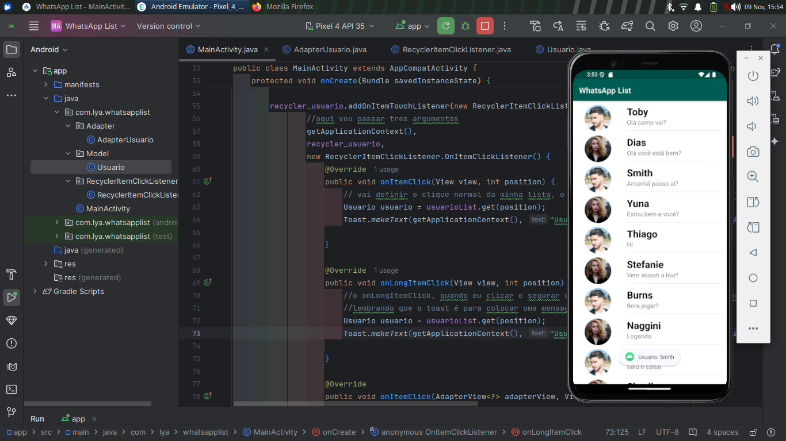

Esse projeto simula uma lista de contatos no estilo WhatsApp, onde cada contato tem uma foto, nome e mensagem exibidos em uma lista de rolagem. O projeto usa RecyclerView, um componente eficiente para exibir listas de grande tamanho. Abaixo, explico cada parte do código:
1. MainActivity

    Configura o RecyclerView para exibir a lista de usuários.
    Inicializa uma lista de objetos Usuario e define um Adapter (AdapterUsuario) para gerenciar a exibição dos itens da lista.
    Define um layout vertical para o RecyclerView com LinearLayoutManager e melhora o desempenho com setHasFixedSize(true).
    Usa addOnItemTouchListener para configurar eventos de clique simples e longo na lista, exibindo o nome do usuário em um Toast quando clicado.
    Método Usuarios() adiciona objetos Usuario na lista, simulando uma lista de contatos com diferentes nomes, fotos e mensagens.

2. AdapterUsuario

    Gera a visualização dos itens da lista para o RecyclerView.
    Construtor: Recebe uma lista de Usuario e a armazena.
    onCreateViewHolder: Infla o layout de cada item (usuario_item.xml) e cria uma instância de UsuarioViewHolder para gerenciar a visualização.
    onBindViewHolder: Configura os dados de cada item da lista, vinculando a foto, nome e mensagem do usuário.
    getItemCount: Retorna o tamanho total da lista de usuários.
    UsuarioViewHolder: Classe interna que mapeia os componentes (foto, nome e mensagem) no layout usuario_item.xml para que possam ser acessados no onBindViewHolder.

3. Usuario (Modelo)

    Classe que define as propriedades de cada usuário: foto, nome e mensagem.
    Construtor: Inicializa essas propriedades para cada objeto Usuario.
    Getters e Setters: Métodos para acessar e modificar os dados de cada propriedade.

Explicação Geral

Esse aplicativo exibe uma lista de usuários fictícios, onde cada item inclui uma foto, um nome e uma mensagem. Quando o usuário clica ou mantém pressionado um item, um Toast aparece mostrando o nome do contato. A combinação de RecyclerView, Adapter e ViewHolder permite uma renderização eficiente, e o RecyclerView se beneficia de rolagem suave e otimizações para grandes conjuntos de dados.

Esse projeto é útil para quem está aprendendo sobre listas dinâmicas no Android, especialmente o RecyclerView, que é mais eficiente que o antigo ListView para grandes quantidades de dados.
